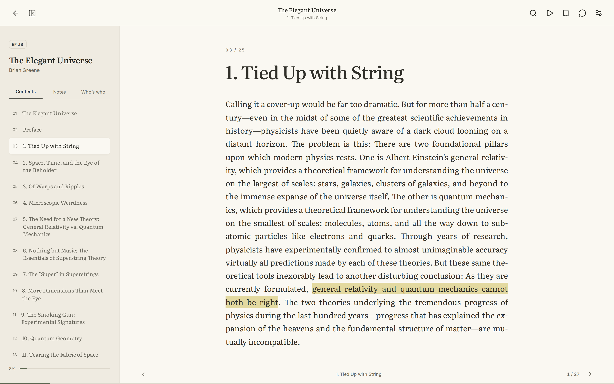
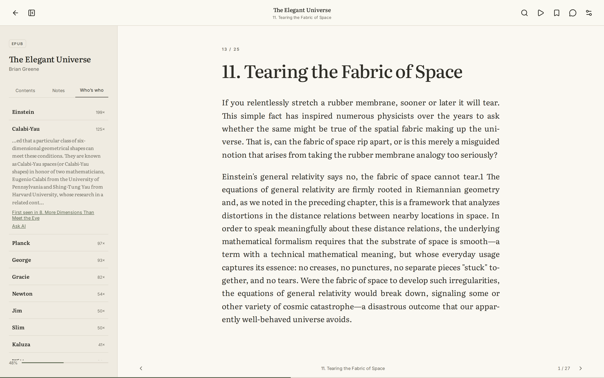
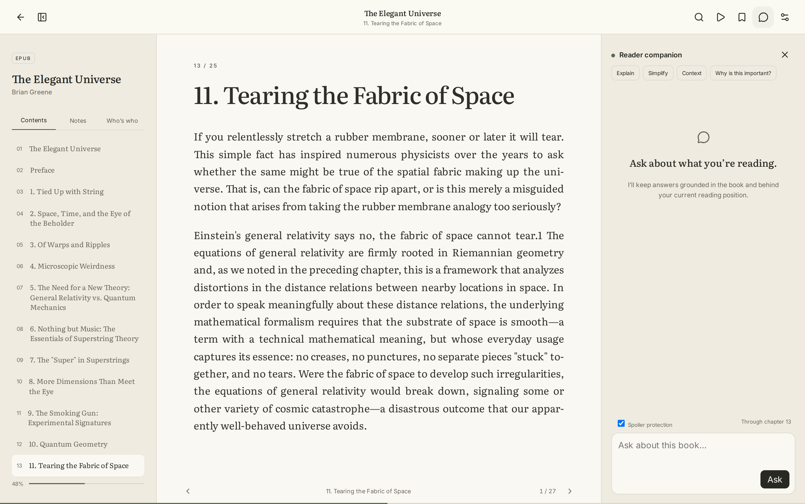
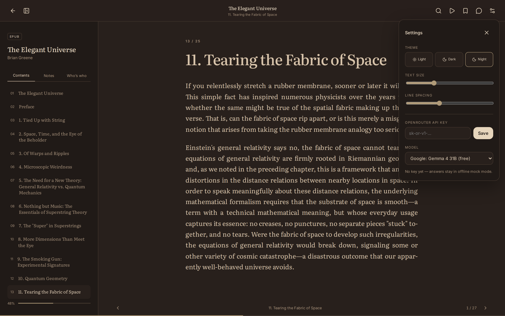
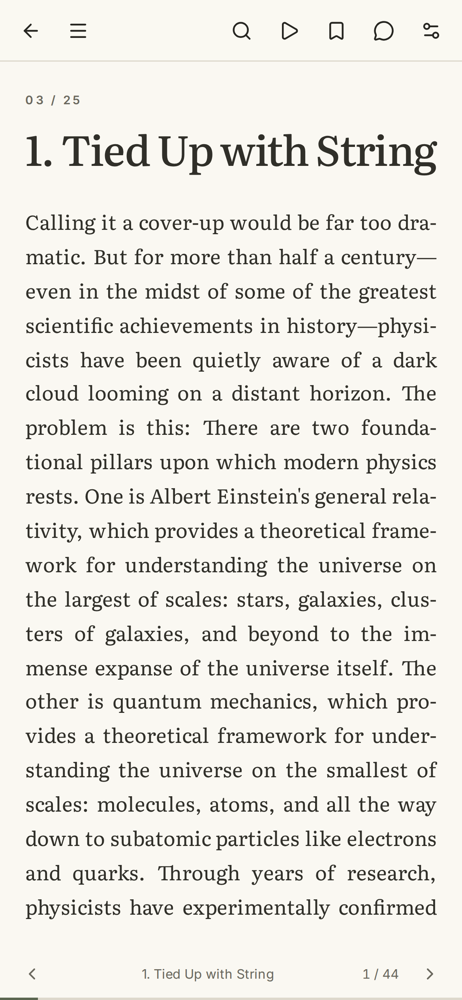
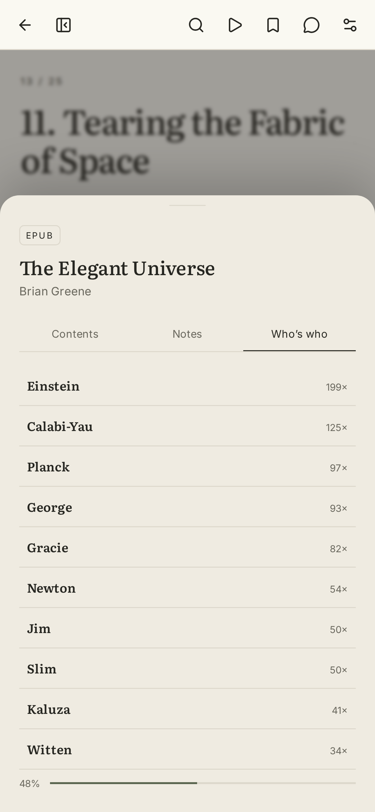

# Sinestra

A self-hosted ebook reader for the books that are hard to read.

Not hard as in badly written — hard as in *dense*. Hard science fiction that assumes you remember what a Dyson swarm is. A physics book that introduced a term four chapters ago and has been leaning on it ever since. A Russian novel with sixty named characters, half of them going by three names each. The kind of book where the friction isn't the prose, it's the load you're expected to be carrying.

Every reader can turn a page. Sinestra is built around the part that actually makes you put the book down.



---

## The problem it solves

You are two hundred pages into a hard SF novel. Someone mentions the Qeng Ho. You have absolutely no idea who they are anymore.

Your options today are all bad. Search the web and you will be spoiled inside of ten seconds — the top result is a wiki page that opens with how the story ends. Ask a chatbot in another tab and it answers from the whole internet, not from your book, and it will happily invent a detail that isn't in the text. Flip back through the pages yourself and you have lost the thread you were following.

Sinestra keeps the help inside the book, and behind where you are.

**Who's who** is an index of every name and term the book has introduced *so far*, built from the text of the chapters you have actually read. Nothing further ahead than your bookmark is in it, because it was never read. It can't spoil you — not as a policy, as a consequence of how it is built. There is no model involved, so there is nothing to hallucinate: a name is a word the book capitalises almost every time it uses it. Open an entry and you get its first appearance in the book, verbatim, with a jump to the chapter it came from.



**Ask** answers from the book's own text, retrieving only from chapters at or before your position. Spoiler protection is a checkbox in the panel, not a promise in a system prompt — future chapters are filtered out of the retrieval before the model ever sees them. Answers cite the chapters they came from and you can jump straight to the source.



**Explain** is the same thing without leaving the page. Select a sentence you didn't follow, hit Explain, and the answer is pinned to that sentence as a margin note. It's still there next week when you come back to the passage. Notes and highlights export to Markdown, so a year of reading becomes a file you own.

**Where you left off** shows a recap when you reopen a book you've been away from — assembled from the chapters behind you, so it can only remind, never reveal.

---

## What it does as a reader

Paginated, not scrolled. The page is whatever your screen is: CSS multi-column with the column width pinned to the viewport, so the browser's overflow columns *are* the pages. Swipe or tap the edges on a phone; arrows, space, page keys, or the scroll wheel on a laptop. Turn past the last page of a chapter and you land on page one of the next; turn back and you land on the *last* page of the previous one, the way a book behaves.

Your position is stored as a fraction of the chapter, not a page number, so stopping on page 4 of 48 on a laptop puts you on page 6 of 76 on a phone — the same sentence, not the same integer.

| | |
|---|---|
| Formats | EPUB, PDF, TXT, Markdown |
| EPUB structure | Spine order for reading order, NCX for real chapter titles, split at TOC anchors — calibre-style files that pack twelve chapters into one document come out as twelve chapters |
| Figures | Inline images and publisher cover art streamed straight out of the uploaded file |
| Typography | Literata, justified with hyphenation; text size and line spacing that actually move the text and persist |
| Themes | Light, dark, and a warm low-blue night mode |
| Annotation | Highlights painted back into the running text on every load, with notes, deletion, and Markdown export |
| Also | Full-text search, bookmarks, browser read-aloud, drag-and-drop upload, undoable delete |



Everything is reachable on a phone — same features, no stripped-down mobile mode, no bottom bar stealing a fifth of the screen.

<p>
  
  
</p>

---

## Running it

Node 20+ and Python 3.11+.

```bash
git clone git@github.com:sajjadriaj/sinestra.git
cd sinestra

python -m venv .venv
source .venv/bin/activate
pip install -r backend/requirements.txt

npm install
npm --prefix frontend install

npm run dev
```

The reader is at `http://localhost:5173`. The API and its interactive docs are at `http://localhost:8013/docs`.

There is a public-domain sample in `samples/` if you want something to upload immediately. Otherwise drop any EPUB, PDF, TXT, or Markdown file onto the library — the whole page is a drop target.


### Turning on the AI features

Ask, Explain, and the recap need a model. Sinestra talks to [OpenRouter](https://openrouter.ai), which has a free tier that is enough for this.

Open the reader, click the sliders icon in the top right, and paste an OpenRouter key. It is stored server-side; the browser only ever sees the last four characters. Pick any model from the list — it is fetched live from OpenRouter and filtered to the free ones, so a retired model never lingers in a hardcoded array.

If you would rather keep it out of the database, set `OPENROUTER_API_KEY` in the environment instead.

Without a key nothing breaks. Ask falls back to returning the relevant passages from the book itself, and the recap gives you the closing paragraphs of the chapter you finished. Who's who needs no key at all — it never uses a model.

### Containers

```bash
docker compose up --build
```

Same addresses as the dev setup: the reader on `http://localhost:5173` with nginx proxying `/api` to the backend container, and the API docs on `http://localhost:8013/docs`. Uploads and the SQLite file live in the `sinestra-data` volume. Deleting a book cascades its chapters, highlights, bookmarks, and progress, and removes the stored source file.

### Tests

```bash
npm test        # 4 frontend (vitest + testing-library), 7 backend (pytest)
npm run build   # typecheck and production bundle
```

---

## How it works

```
backend/app
  main.py               API — books, progress, annotations, search, dossier, recap, export, assets
  models.py             SQLAlchemy: Book, Chapter, Progress, Highlight, Bookmark, Setting
  services/parsers.py   EPUB/PDF/TXT extraction — spine walking, TOC anchor splitting, figures
frontend/src
  App.tsx               Library and reader
  lib/api.ts            Typed fetch layer
  styles.css            One stylesheet, tokens at the top
```

Books are parsed once on upload into chapters of plain text, which is what makes search, retrieval, and the dossier cheap — no re-parsing on every open. The original file is kept, and images are served out of it on demand rather than being unpacked to disk.

Highlights are stored as their own text, not as a byte offset. On load, each highlight is split into per-paragraph fragments and matched back into the rendered text. That is why an annotation survives a font change, a window resize, or a phone — there is no coordinate to invalidate.

`GET /api/books/{id}/dossier?chapter_index=N` builds Who's who in a single pass over the chapters read so far. A candidate is a word that is capitalised at least four times, at least five times as often as it appears lowercase, is not only ever a sentence opener (which kills "However" and "Moreover"), and is not usually followed by a number (which kills "Chapter 6" and "Figure 3.1"). Runs of adjacent candidates become one entry, so Calabi and Yau arrive as Calabi-Yau. It runs in about a tenth of a second across a full book.

Assets are read out of the stored archive by exact name against the zip's own index, so a `../` in a request path matches nothing and returns 404.

---

## Status and honest limits

This is a personal reader that works, not a finished product.

- **PDFs are text-only.** Pages are extracted as text and reflowed into the same typographic surface as everything else. There is no canvas rendering, so a PDF that is mostly layout — a scanned book, a paper with figures — will lose that layout.
- **Tables in EPUBs are skipped.** Table markup that lives outside the reading spine is not reachable from the reader.
- **No account system.** Anyone who can reach the port can read the library and read back the last four characters of the stored API key. Run it on a private network, a tailnet, or behind your own auth.
- **The dossier is a heuristic.** It is very good on non-fiction and on fiction with distinct names. It will occasionally admit an odd term and occasionally miss a name that the book only capitalises inconsistently.
- **Read-aloud uses the browser's built-in speech synthesis**, which sounds like the browser's built-in speech synthesis.

## License

MIT — see [LICENSE](LICENSE). The sample text in `samples/` is public domain.
